# 3. Zero-Dimensional Nanostructures: Nanoparticles

:::{contents}
:local:
:depth: 2
:::

## Nanoparticles

Requirement for NPs:

1. Monosized
2. Homogeneous morphology
3. Homogeneous composition/structure
4. Monodisperse (not agglomerated)

Definitions:

- Nanoparticle: Material where all three
  dimensions are in the nanoscale regime
  (a “zero-dimensional” nanomaterial)
- Nanocrystal: Crystalline nanoparticles
- Quantum dots: Semiconductor
  nanocrystals with fluorescent properties

## Top down and bottom up synthesis approaches

### Top down:

Refining of bulk materials. E.g. Ball milling, etching, attrition, quenching.

Advantages:

- High production yield
- Easy to scale up
- Cost effective

Disadvantages:

- Broad size distribution
- Varied particle morphology
- Impurities from the mechanical process
- Defective nanostructures

Not otherwise covered in this course except for lithography.

### Bottom up

Scaling up from single atoms. E.g. Colloidal synthesis, sol-gel, hydrothermal synthesis, spray pyrolysis.

Advantages:

- Controlled size, morphology and composition.
- Hight purity, few defects.
- Const effective

Disadvantages:

- Potentially low yield.
- More complicated.
- Sometimes difficult to scale up.

The bottom up method is further divided into two methods:

1. **Thermodynamic equilibrium approach** (Nucleation and growth).
2. **Kinetic approach** (E.g. microemulsion, aerosol pyrolysis, template based deposition).

## Homogeneous nucleation

Homogeneous nucleation differs from heterogeneous nucleation i that it does not occur at an interface. Like heterogeneous nucleation however, it can occur in gasses, liquids and solids.

For homogenous growth a supersaturated medium is required. Supersaturation is defined as when the concentration of solute in a solvent exceeds the equilibrium solubility.

Homogeneous nucleation happens to reduce the gibbs free energy of a system that is supersaturated. The energy of the system is lowered by precipitation of solid material from the solution as shown in {numref}`fig_homogenous`.

:::{figure-md} fig_homogenous
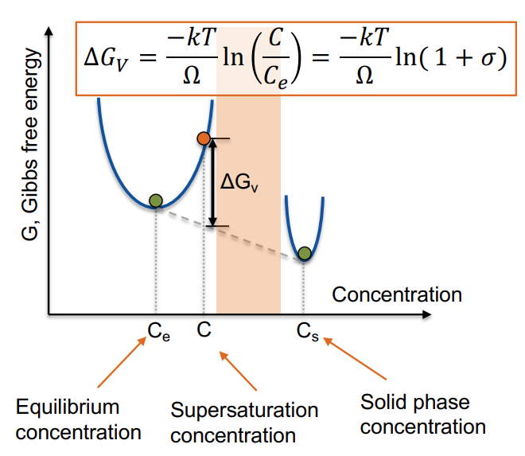

Figure showing Gibbs free energy for different concentrations of solute.
:::

Some notation for supersaturation ($\sigma$):

$$
\sigma = \frac{C-C_e}{C_e}
$$

$$
1 + \sigma = \frac{C}{C_e}
$$

$\sigma = 0$: No supersaturation $\implies \Delta G_v = 0$ No nucleation occurs.  
$C>C_0 \implies \Delta G_v < 0$ Nucleation would occur spontaneously if not for surface energy. Free energy including surface energy shown in {numref}`fig_hom_surf`.

:::{figure-md} fig_hom_surf
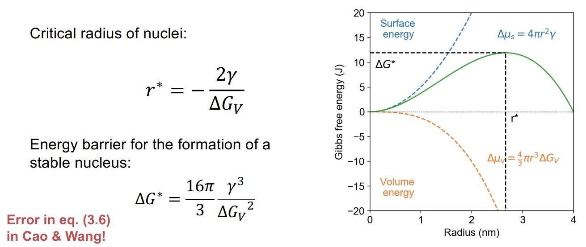

Equations for critical radii of nuclei and energy barrier for stable nucleus formation, and plot of total free energy including surface energy.
:::

When nanoparticles from a supersaturated medium are desired,
we need to reduce the critical size r\*, and the free energy ΔG, i.e.

1. Reduce $\gamma$
2. Make $\Delta G_v$ more negative

Also: lower T tends to decrease $\gamma$

:::{figure-md} fig_growth
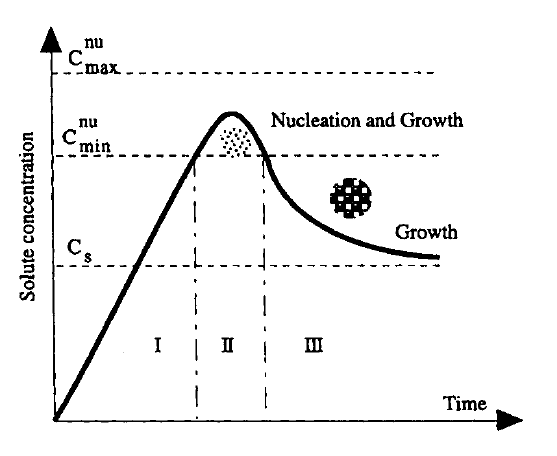

Schematic illustrating the processes of nucleation and subsequent growth. Region I: No nucleation, Region II: Nucleation and growth, Region III: Only growth.
$C^{nu}_{min}$: Minimum concentration associated with energy barrier
:::

## Synthesis of metallic nanoparticles

General method: reduction of metal complexes in dilute solution.

The formation of monosized metallic NPs is achieved in most cases by a combination of:

- Low concentration of solute
- Polymeric monolayer adhered onto the growth surface in order to hinder the diffusion of the growth species. (Polymer stabilizer)

### Effects of reduction agents

Different reduction agent type, concentration, and pH $\implies$ different size, size distribution, and morphology, of the obtained nanoparticles.

- Strong reduction reagents promote a fast reaction rate, favoring the
  formation of smaller NPs
- Weak reduction reagents induce slow reaction rate and favor
  relatively larger particles

Examples of different morphology due to reduction agents:

- Sodium citrate (Na$_3$C$_6$H$_5$O$_7$) $\implies$ Spherical shape
- Citric acid (C$_6$H$_8$O$_7$) $\implies$ Faceted particle formations

### Effects of polymer stabilizers

Polymers can have many functions during NP synthesis:

1. Stabilization agents: By forming a monolayer on the surface of the NPs
2. Growth limiting agents. Requires full coverage.
3. Growth directing agents. The effect depends on:
   - The surface chemistry of the solid
   - The solvent
   - The temperature

### Synthesis by electrochemical deposition

Recipe:

1. Electric field is applied
2. Metal anode dissolves
3. Metal ions migrate through electrolyte
   - Reduction
   - Stabilized by additives in the electrolyte

Increased current density results in smaller NPs.

## Sol-gel synthesis

Sol-gel process is a wet chemical route that
involves the generation of a colloidal solution
(‘sol’ for solution), which is subsequently
converted to viscous gel and then to a solid
material.

Mostly used for synthesis of metal oxide NPs
(SiO2, TiO2,..)

Sol-gel goes via hydrolysis and polycondensation of precursors ({numref}`fig_sol`, {numref}`fig_sol2`):

- Precursor is mixed with the solvent to form a sol (solution).
- The sol converts into a non-fluidic 3D network (gel).

:::{figure-md} fig_sol
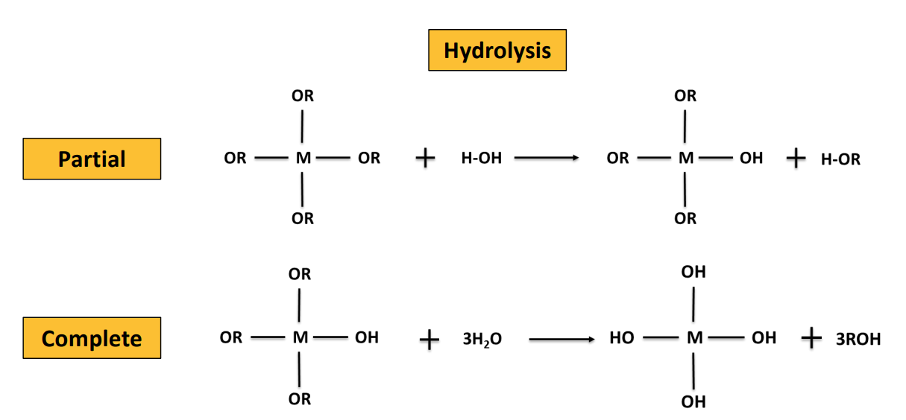

Figure showing partial and complete hydrolysis of a precursor, which is the first step in sol-gel processing.
:::

:::{figure-md} fig_sol2
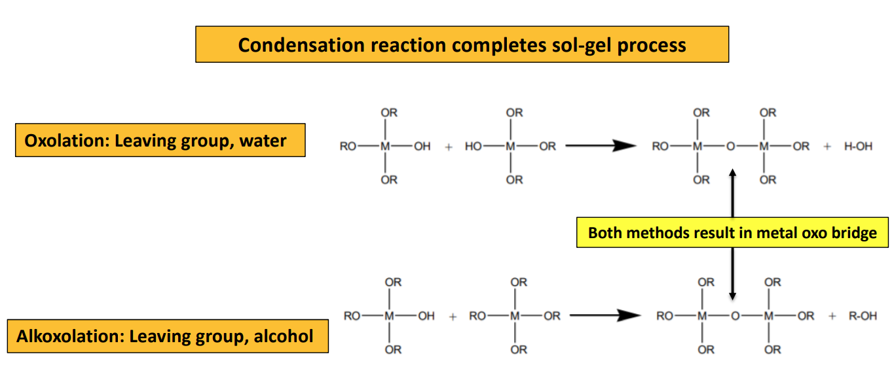

Figure showing the condensation of the previously hydrolyzed precursor, which is the second step in sol-gel processing.
:::

### Steps in sol-gel processing

1. Sol: Formation of stable solution by hydrolysis and partial condensation of
   precursor.
2. Gel: Formation of metal oxo bonds.
3. Aging: Condensation continues within the gel, resulting in shrinking and
   densification along with expulsion of solvent.
4. Drying: Water and other volatile impurities are removed from the gel network.
5. Dehydration: Removal of surface M-OH groups via calcination at ~ 800 °C.
6. Thermal treatment: Densification of the gels at temperatures > 800 °C via sintering and grain growth.

During the drying process, the following morphologies can be obtained (shown in {numref}`fig_sol_outcomes`):

- Xerogel: Solvent is removed by evaporation. Often
  results in extreme shrinkage and densification of
  the gel. (shrinkage > 90 %)
- Aerogel: Solvent is removed by supercritical
  drying. The gel maintains its morphology and
  results in low density product. (shrinkage < 15 %)

:::{figure-md} fig_sol_outcomes
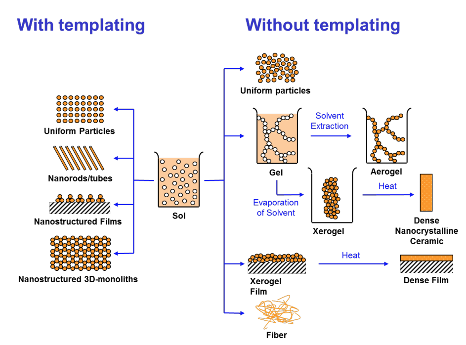

Figure showing different end products from sol-gel processing.
:::

### Silica NPs via Stöber process

Specifics can be found in lecture slides

TEOS (tetraethyl orthosilicate), which is one of the most common metal oxides used. The process is shown in {numref}`fig_stober`, and the effect of increasing the concentrations of ammonium hydroxide is shown in {numref}`fig_stober2`.

:::{figure-md} fig_stober
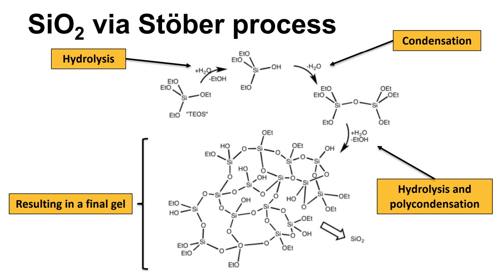

Figure showing the basics of the Stöber process.
:::

:::{figure-md} fig_stober2
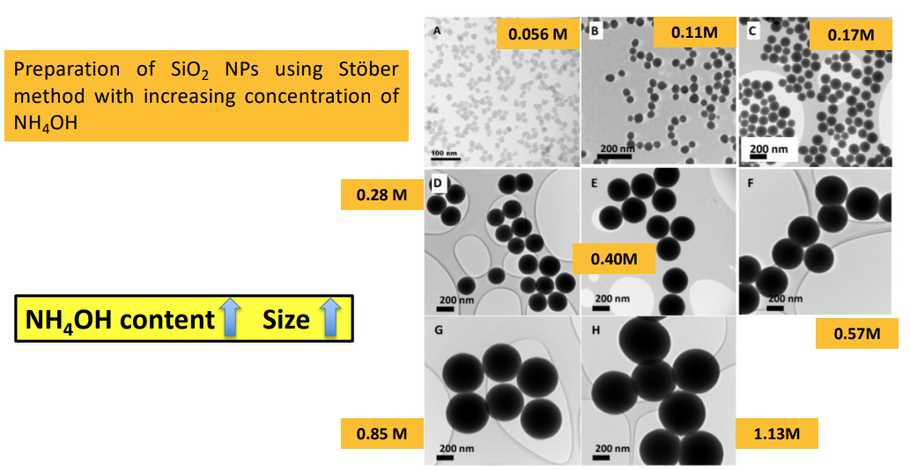

Figure showing the effect of increasing the amount of ammonium hydroxide.
:::

### Advantages of sol-gel

1. Versatile: Better control of the structure, including porosity and particle size; possibility of incorporating
   nanoparticles and organic materials into sol-gel-derived oxides.
2. Extended composition ranges: It allows the fabrication of any oxide composition, but also some nonoxides, as well as the production of new hybrid organic-inorganic materials which do not exist naturally.
3. Better homogeneity: Due to mixing at the molecular level; high purity.
4. Less energy consumption: There is no need to reach the melting temperature, since the network structure can be achieved at relatively low temperatures.
5. Products: Coatings and thin films, monoliths, composites, porous membranes, powders and fibers.
6. Inexpensive: No need for special or expensive equipment.

## Hybrid nanoparticles

Constructed from at leas two different nanoparticles, in order to overcome the limits of single-component nanoparticles, to improve properties, to achieve new properties not possible for single nanoparticles, and/or to achieve multiple functionalities for single nanoparticles
E.g. incorporating magnetic nanoparticles in a silica shell ({numref}`fig_hybrid`).

:::{figure-md} fig_hybrid
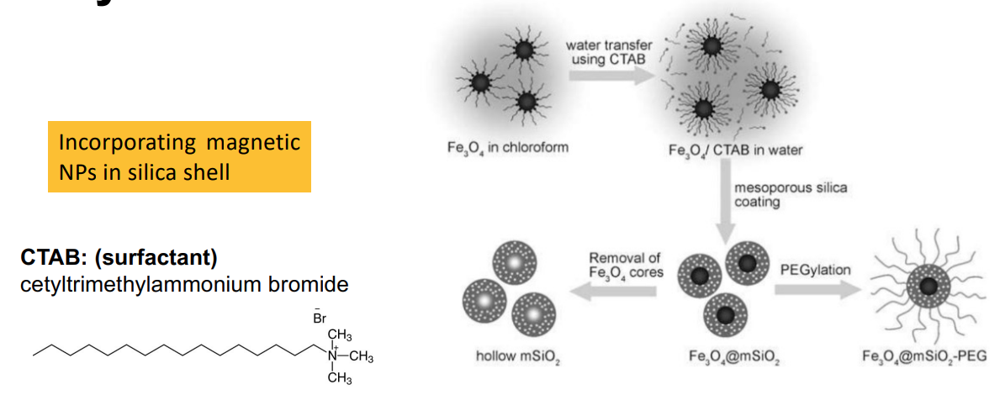

Figure showing the silica hybrid nanoparticles.
:::

## Vapour phase synthesis

- Fundamentals of homogeneous nucleation in the liquid phase hold true for vapour phase synthesis as well.
- Process requires elevated temperatures and often vacuum.
- Particles nucleate homogeneously upon reaching sufficient supersaturation condition and are often deposited on a target substrate.
- Once nucleation starts, supersaturation is relieved and growth starts.
- Rapid quenching prevents particle growth by either removing the source or slowing the kinetics.

Some other things to consider:

- Generally, formed nanoparticles are deposited on a solid substrate.
- Long time deposition can lead to the formation of agglomerates.
  The deposited nanoparticles can migrate and agglomerate on the surface to form spherical or needle-like shapes.

Three different types of vapour phase synthesis methods are discussed, as shown in {numref}`fig_vps`.

:::{figure-md} fig_vps
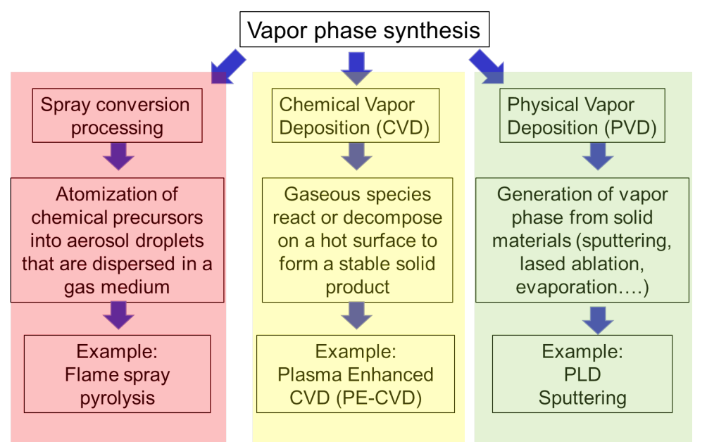

Figure showing the three different types of vapour phase synthesis to be discussed.
:::

### Chemical vapour deposition (CVD)

Short explanation of CVD:
Reagents are transported to the deposition zone, and gas phase reactions in the boundary layer leads to the production of precursors and byproducts. The precursor is then adsorbed on the surface, and moves to the growth site due to diffusion. Chemical reaction on the growth site then leads to deposition, and by-products are desorbed. CVD also shown in {numref}`fig_cvd`.

:::{figure-md} fig_cvd
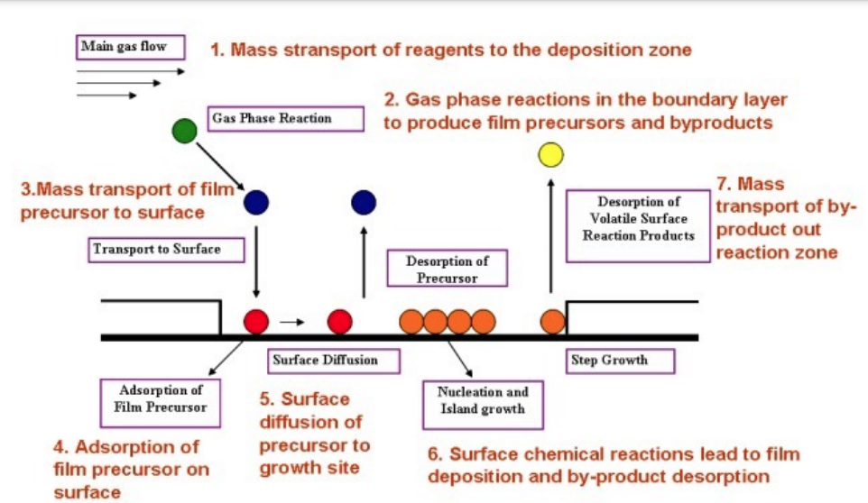

Figure showing CVD.
:::

### Physical vapour deposition (PVD)

With PVD the source material is evaporated by
for instance thermal evaporation og plasma
assisted sputtering, and after deposited on the
substrate. Also shown in {numref}`fig_pvd`.

:::{figure-md} fig_pvd
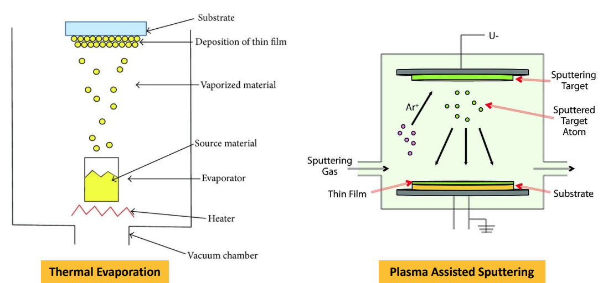

Figure showing PVD.
:::

## Heterogeneous nucleation

Heterogeneous nucleation occurs at an interface, in the presence of foreign crystals, and requires a lower degree of supersaturation ({numref}`fig_hetnuc`) compared to homogenous nucleation.

:::{figure-md} fig_hetnuc
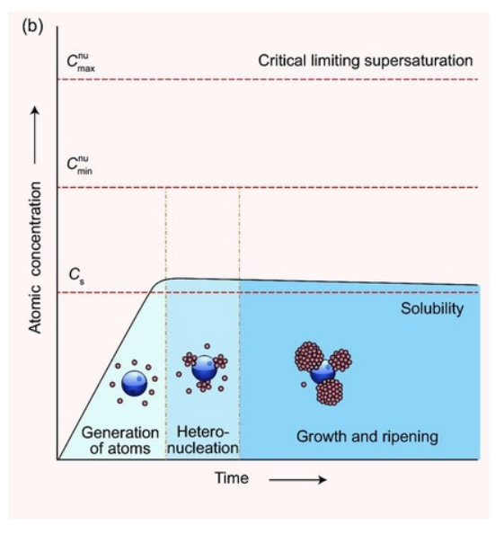

Concentration, time diagram for heterogeneous nucleation. Notice that the nucleation starts much lower than $C^{nu}_{min}$, which is where homogeneous nucleation starts.
:::

### Solubility-supersolubility diagram

{numref}`fig_solsup` shows a solubility-supersolubility diagram.

:::{figure-md} fig_solsup
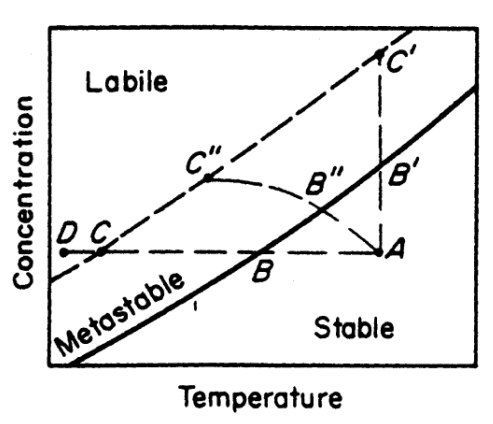

Solubility-supersolubility diagram.
:::

Zones:

- Stable zone: Crystallization is impossible.
- Metastable zone: Crystallization is improbable.
- Labile zone: Spontaneous crystallization is probable.

Moving from stable to labile zone:

1. Reducing temperature and maintaining the same solvent content.
   - A-B-C-D
2. Evaporation
   - A-B’-C’
3. Combination of 1 and 2
   - A-B’’-C’’

### Interfacial tension ($\gamma$)

For heterogeneous nucleation contact angle ($\theta$) matters, and is defined by Youngs equation:

$$
\gamma_{sv} = \gamma_{fs} + \gamma_{vf}\cos{\theta}
$$

$\gamma_{sv}$ is the surface energy of substrate-vapour.  
$\gamma_{fs}$ is the surface energy of nucleus-substrate.  
$\gamma_{vf}$ is the surface energy of vapour-nucleus.

:::{figure-md} fig_contact_angle
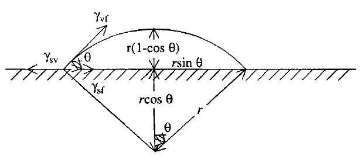

Schematic illustrating heterogeneous nucleation process with all related surface
energies in equilibrium.
:::

This leads to a modified critical Gibbs free energy equation which includes a wetting factor, as shown in {numref}`fig_wetting`.

:::{figure-md} fig_wetting
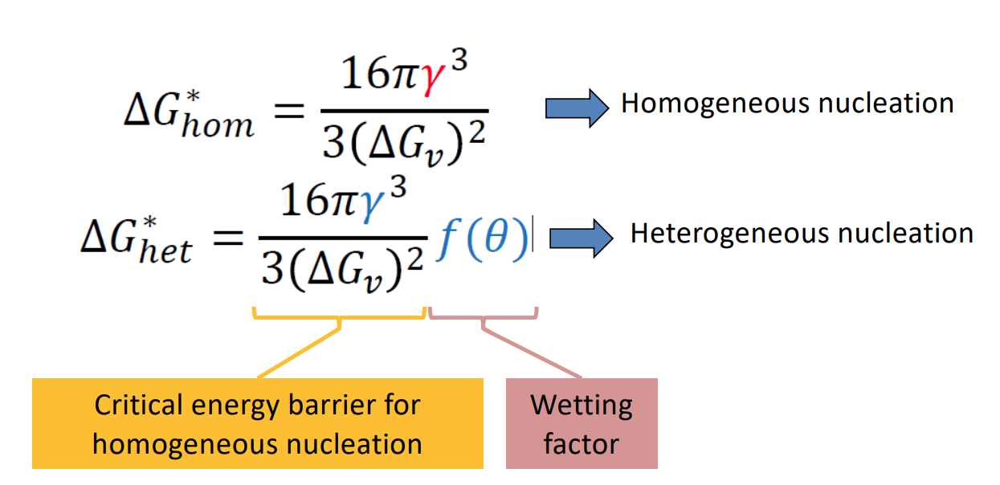

Critical Gibbs free energy equations for homogeneous nucleation and heterogeneous nucleation.
:::

The wetting factor:

$$
f(\theta) = \frac{2-3\cos\theta+\cos^3\theta}{4}
$$

Cases for the wetting factor:

- $\theta = 180°$, no whetting, and $\Delta G^*_{\text{het}} = \Delta G^*_{\text{hom}}$.
- $0<\theta<180°$, partial whetting, and $\Delta G^*_{\text{het}} < \Delta G^*_{\text{hom}}$.
- $\theta = 0°$, complete whetting, and $\Delta G^*_{\text{het}} = \Delta G^*_{\text{hom}} = 0$.

N.B. In the following lecture slides, as an example of heterogenous growth the growth mechanisms of Fe-Ag Dumbbell Nanoparticles are discussed. This will not be included here.

## Kinetically confined synthesis
