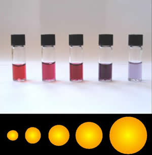

# Introduction

## Main approaches:

1. Top down: Refining or reducing bulk materials
2. Bottom up: Scaling up from single atoms

## What makes nanomaterials interesting?

At nm scale, material properties become size dependent, and often change qualitatively.

## Size dependent properties:

- Large fraction of surface atoms  
  Micro-sphere: r = 1 µm $\rightarrow \frac{V_{surface}}{V_{sphere}} = 0.0006$  
  Nano-sphere: r = 1 nm $\rightarrow \frac{V_{surface}}{V_{sphere}} = 0.6$
- Large surface area/energy
- Spatial confinement (e.g. quantum dots)
- Fewer defects makes the materials have:
  1.  Nearly ideal strength
  2.  Much lower electric resistance

### How does this affect material properties?

- Smaller particles $\rightarrow$ lower melting point
- Optical absorption depends on:
  1.  Size (different sized gold particles have different color as shown in {numref}`fig_goldnp`)
  2.  Shape (different shape can change absorption and scattering of light, due to surface plasmon resonance)

:::{figure-md} fig_goldnp

Gold nanoparticles of different sizes
:::
